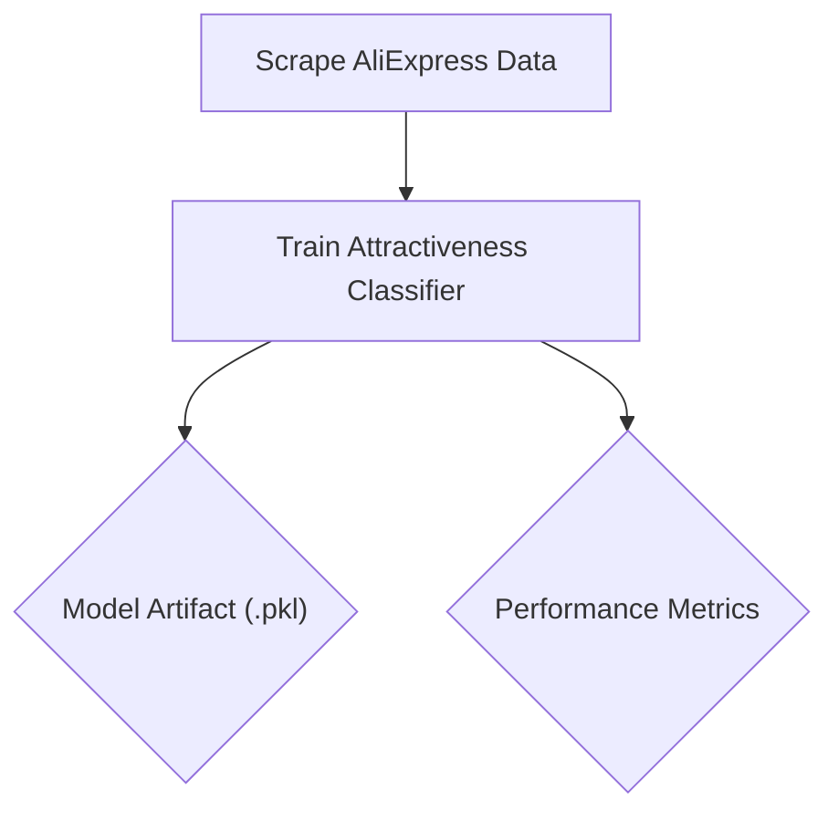

<div>
  
</div>

# Smart E-commerce AI Pipeline

Advanced e-commerce analytics platform combining web scraping, LLM-powered recommendations, and real-time dashboards.

## 🚀 Getting Started

### Prerequisites
- Python 3.9+
- Firefox browser
- [Groq API key](https://console.groq.com/)

### Installation
```bash
# Clone repository
git clone https://github.com/hodaifa-ech/smart-ecommerce-ai-pipeline
cd smart-ecommerce-ai-pipeline

# Install dependencies
pip install -r requirements.txt

# Set API key (Linux/macOS)
export GROQ_API_KEY="your_api_key_here"

# For Windows:
# set GROQ_API_KEY="your_api_key_here"

# Launch application
streamlit run main.py
```

## ✨ Key Features
| Feature | Description |
|---------|-------------|
| 📊 **Interactive Dashboard** | Real-time sales analytics with filters |
| 🚀 **Top Selling Products** | Identify best-performing items |
| 💬 **AI Recommendation Bot** | LLM-powered shopping assistant |
| ⚙️ **Automated Scraping** | Product data extraction pipeline |

## 🛠️ Tech Stack
- **Data Extraction**: Selenium, Firefox
- **AI Engine**: Llama 3 70B (via Groq)
- **Frontend**: Streamlit
- **Data Processing**: CSV, Pandas
- **Infrastructure**: Docker, Kubernetes

## Data Scrapping 
|Shop|Method|Technologies|
|---|---|---|
|  | <br/>  |  <br/>    |
|  |  |API `/products.json`|


## 📸 Application Screenshots

### Dashboard Analytics
|Ali-Express|Shopify|
|---|---|
|  |  |
|| |

*Interactive filters and data visualizations*

### Product Analysis

 |  |  |
|--------|---------|

*Product performance metrics*

### Top k Products

|  |
|----|

*Top performing products*

### AI Shopping Assistant

|  
|---|


*LLM-powered product recommendations*

### Classifier attractiveness 
|  |  | |
|----|---|---|

## 🐳 DevOps Architecture

### Docker Setup
```dockerfile
FROM python:3.9-slim
# ... (rest of Dockerfile) ...
```

### Kubernetes Deployment
```yaml
# k8s/deployment.yaml
apiVersion: apps/v1
kind: Deployment
metadata:
  name: ecommerce-app
  namespace: ecommerce
spec:
  replicas: 1
  selector:
    matchLabels:
      app: ecommerce
  template:
    metadata:
      labels:
        app: ecommerce
    spec:
      containers:
      - name: main-app
        image: your-registry/ecommerce-app:latest
        ports:
        - containerPort: 8501
        resources:
          limits:
            memory: "1Gi"
            cpu: "500m"
```

### CI/CD Pipeline (GitHub Actions)
```yaml
name: Deploy to Kubernetes

on:
  push:
    branches: [main]
  workflow_dispatch:

jobs:
  deploy:
    runs-on: ubuntu-latest
    steps:
      - name: Checkout code
        uses: actions/checkout@v4
      
      - name: Deploy to cluster
        run: |
          kubectl apply -f k8s/deployment.yaml
          kubectl apply -f k8s/service.yaml
```

### Deployment Scripts
```bash
# Build and push Docker image
./build_and_push.sh

# Setup Kubernetes secrets
./setup-k8s-secret.sh

# Monitor application logs
./view-logs.sh
```

## ☁️ Cloud Deployment
```bash
# Start Minikube environment
minikube start

# Deploy application
kubectl apply -f k8s/

# Access application
minikube service ecommerce-service -n ecommerce
```

## 🔄 Kubeflow Pipeline Orchestration

To automate the entire data and model lifecycle, this project implements a Kubeflow Pipeline. This pipeline orchestrates the scraping, data processing, and model training steps in a reproducible and scalable workflow running on top of Kubernetes.

The pipeline defines a Directed Acyclic Graph (DAG) to manage dependencies between tasks:



### Pipeline Components

Each step in the pipeline is a self-contained, containerized component. Here's an example of the scraper component definition:

```python
# kfp/components/scrape_aliexpress_component.py
from kfp.dsl import component, Output, Dataset

@component(
    base_image="python:3.9",
    packages_to_install=[
        "pandas", "selenium", "webdriver-manager", "beautifulsoup4"
    ],)
def scrape_aliexpress_component(
    max_pages: int,
    output_data: Output[Dataset],):
    """A Kubeflow component to scrape products from AliExpress."""
    # ... (Selenium scraping logic)
    # The final DataFrame is saved to the path provided by Kubeflow
    df.to_csv(output_data.path, index=False)
```

### Pipeline Definition

The components are assembled into a pipeline that defines the execution flow and data handoff.

```python
# kfp/pipeline.py
from kfp import dsl
from components import scrape_aliexpress_component, train_classifier_component

@dsl.pipeline(
    name="E-commerce AI Pipeline",
    description="Scrapes product data and trains an attractiveness model.",
    pipeline_root="gs://your-artifact-store/ecommerce-pipeline" # e.g., GCS or MinIO bucket)
def ecommerce_ai_pipeline(max_pages: int = 5):
    """Defines the workflow of the e-commerce AI pipeline."""

    # Step 1: Scrape data
    scrape_task = scrape_aliexpress_component(
        max_pages=max_pages
    )

    # Step 2: Train model using the output from the scraping task
    train_task = train_classifier_component(
        input_dataset=scrape_task.outputs['output_data']
    )
```

### Compiling and Running

The pipeline is compiled to YAML and can be uploaded directly to the Kubeflow UI to create new runs.

```bash
# Compile the pipeline definition
kfp dsl compile --python-function ecommerce_ai_pipeline pipeline.py --output ecommerce_pipeline.yaml

# Upload the generated .yaml file in the Kubeflow Pipelines dashboard.
```

## 🛠️ Troubleshooting
**Common Issues:**
1. **Missing API Key:**
   ```bash
   export GROQ_API_KEY="valid_key"  # Add to ~/.bashrc for persistence
   ```
2. **Selenium Errors:**
   - Ensure Firefox is installed
   - Update geckodriver
3. **Kubernetes Deployment:**
   ```bash
   kubectl get pods -n ecommerce  # Check pod status
   kubectl describe pod [POD_NAME]  # Inspect errors
   ```


**Note:** For production deployments, consider implementing:
- Horizontal Pod Autoscaling
- Persistent volume for data storage
- HTTPS ingress configuration
- Monitoring with Prometheus/Grafana

## 👥 Authors
- Mohamed Amine BAHASSOU 
- Hodaifa ECHFFANI
