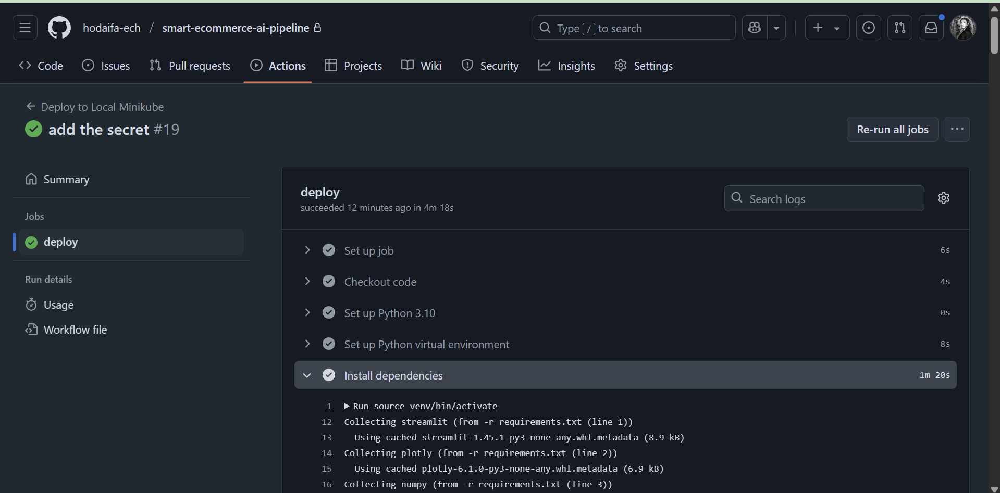
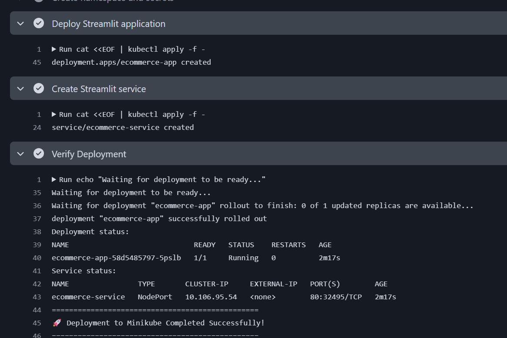
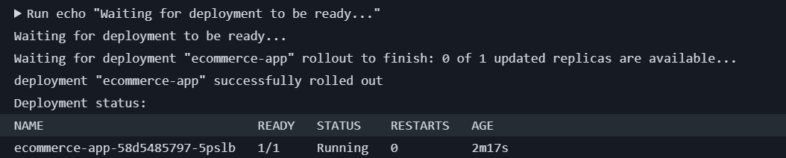
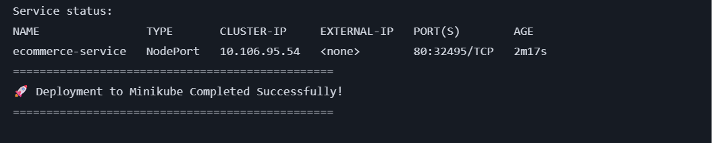
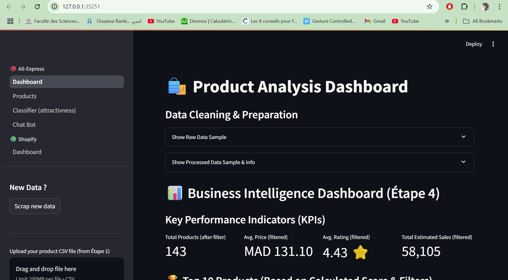

# Getting Started 
```
git clone https://github.com/hodaifa-ech/smart-ecommerce-ai-pipeline
cd smart-ecommerce-ai-pipeline
pip install -r requirement.txt 
streamlit run main.py
```

**requirements:**
```
export GROQ_API_KEY="api_key"                                    
```

# Scraping
* selenium
* firefox
* csv

# LLM Model 
* LLAMA 3 70B - groq provider

# FrontEnd | Data visualization
* streamlit

# Features 
* dashboard
* top selling products
* chat BOT (for recommendation)

# Screen Shots
## Dashboard (Data Visualization, Filters )


## Products (Filters, best selling)


## Chat BOT


# DevOps Architecture

## Docker Setup
The application is containerized using Docker with the following configuration:
```dockerfile
FROM python:3.9-slim
```
- Base image: Python 3.9-slim
- Includes Firefox for Selenium web scraping
- Exposes port 8501 for Streamlit
- Environment variables for API keys
- Optimized layer caching for faster builds

## Kubernetes Deployment
The application is deployed on Kubernetes with the following components:

### Namespace
- `ecommerce`: Isolated environment for the application

### Deployment
- Name: `ecommerce-app`
- Replicas: 1
- Resources:
  - Requests: 512Mi memory, 250m CPU
  - Limits: 1Gi memory, 500m CPU

### Service
- Name: `ecommerce-service`
- Type: NodePort
- Port: 80
- Target Port: 8501

### Secrets
- `groq-secret`: Stores API keys securely
- Managed through `setup-k8s-secret.sh`

## CI/CD Pipeline (GitHub Actions)
The pipeline is triggered on:
- Push to main branch
- Manual workflow dispatch

### Pipeline Steps
1. **Environment Setup**
   - Checkout code
   - Setup Python 3.10
   - Create virtual environment
   - Install dependencies

2. **Deployment**
   - Clean up old deployments
   - Create namespace and secrets
   - Deploy Streamlit application
   - Create service
   - Verify deployment

3. **Post-Deployment**
   - Display access URL
   - Show deployment status
   - Provide logging instructions

## Utility Scripts

### 1. build_and_push.sh
```bash
# Build and push Docker image
./build_and_push.sh
```
- Builds Docker image
- Logs into Docker Hub
- Pushes image to registry

### 2. view-logs.sh
```bash
# View application logs
./view-logs.sh
```
- Automatically finds the correct pod
- Streams logs in real-time
- Easy to monitor application status

### 3. setup-k8s-secret.sh
```bash
# Setup Kubernetes secrets
./setup-k8s-secret.sh
```
- Creates necessary Kubernetes secrets
- Manages API keys securely

## Accessing the Application


After deployment, the application is accessible at:
- Streamlit Dashboard: `http://<minikube-ip>:<nodeport>`

## Accessing the Application in Minikube

### 1. Start Minikube
```bash
# Start Minikube
minikube start

# Verify Minikube is running
minikube status
```

### 2. Deploy the Application
```bash
# Deploy using the GitHub Actions workflow
# Or manually deploy using:
kubectl apply -f k8s/deployment.yaml
kubectl apply -f k8s/service.yaml
```

### 3. Access the Application
```bash
# Get the Minikube IP
minikube ip

# Get the NodePort
kubectl get svc ecommerce-service -n ecommerce -o jsonpath='{.spec.ports[0].nodePort}'

# Access the application at:
# http://<minikube-ip>:<nodeport>
```

### 4. Common Minikube Commands
```bash
# View all pods
kubectl get pods -n ecommerce

# View logs
./view-logs.sh

# Restart Minikube if needed
minikube stop
minikube start

# Delete the deployment
kubectl delete deployment ecommerce-app -n ecommerce
kubectl delete service ecommerce-service -n ecommerce
```

### 5. Troubleshooting
If you can't access the application:
1. Check if Minikube is running:
   ```bash
   minikube status
   ```
2. Verify the pod is running:
   ```bash
   kubectl get pods -n ecommerce
   ```
3. Check the service:
   ```bash
   kubectl get svc -n ecommerce
   ```
4. View pod logs:
   ```bash
   ./view-logs.sh
   ```

## Monitoring and Maintenance

### Logs
- Use `view-logs.sh` to monitor application logs
- Logs include:
  - Application startup
  - Scraping operations
  - API calls
  - Error tracking

### Resource Monitoring
- Monitor pod status: `kubectl get pods -n minikube stop
minikube start
`
- Check service status: `kubectl get svc -n ecommerce`
- View resource usage: `kubectl top pods -n ecommerce`

### Troubleshooting
1. Check pod status:
   ```bash
   kubectl describe pod <pod-name> -n ecommerce
   ```
2. View pod logs:
   ```bash
   kubectl logs <pod-name> -n ecommerce
   ```
3. Check service endpoints:
   ```bash
   kubectl get endpoints -n ecommerce
   ```


## DevOps Screenshots

### 1. GitHub Actions

*Successful workflow run in GitHub Actions*


*Deployment steps showing successful pod and service creation*

### 2. Kubernetes Deployment

*Kubernetes pods running in the ecommerce namespace*


*NodePort service configuration*


*Streamlit application running in browser*


   ```
# Authors 
* Mohamed Amine BAHASSOU
* Hodaifa ECHFFANI